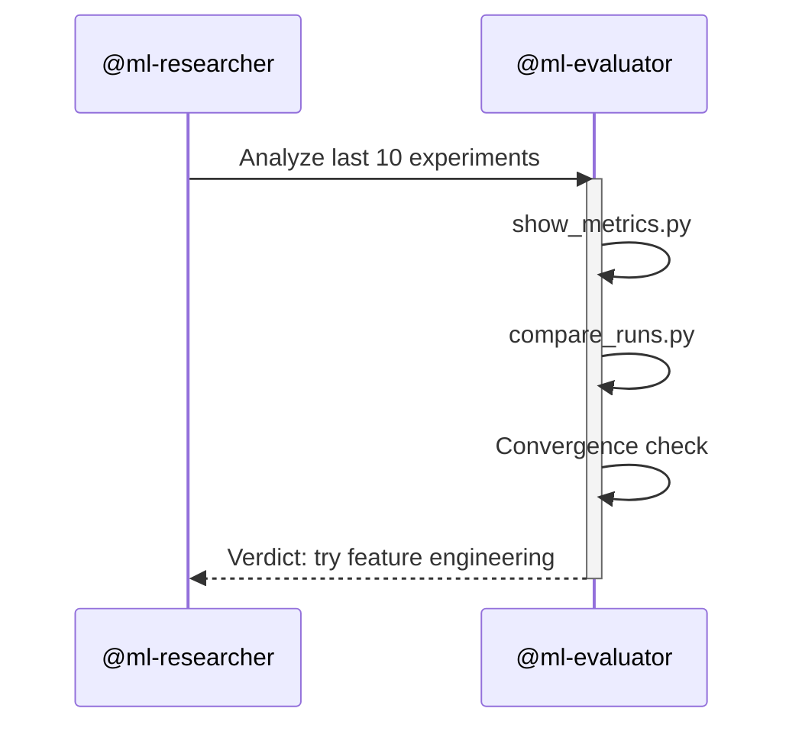

# Agent Architecture

Turing uses two agents with a strict capability boundary between them. The researcher can modify code and run experiments. The evaluator can only read and analyze. This is not a convenience division; it is the load-bearing safety mechanism that makes the evaluator's observations trustworthy.

> An analyst who cannot act on their observations makes more trustworthy observations.

## The Two Agents

### @ml-researcher

The autonomous experimenter. Implements the full [experiment loop](experiment-loop.md).

| Property | Value |
|----------|-------|
| **Tools** | Read, Write, Edit, Bash (whitelisted), Grep, Glob |
| **Max turns** | 200 |
| **Memory** | Persistent (`.claude/agent-memory/ml-researcher/MEMORY.md`) |
| **Can modify** | `train.py`, `config.yaml` |
| **Cannot access** | `evaluate.py` (hidden), `prepare.py` (read-only) |

The researcher operates under the [loop protocol rules](anti-cheating.md): Bash access is whitelisted to specific commands, file access is tiered, and every experiment is committed to git before execution.

**Bash whitelist:**

```
python train.py:*           # Execute training
python scripts/*:*          # Utility scripts
git:*                       # Version control
source .venv/bin/activate:* # Environment
pip:*                       # Packages (human approval required)
```

**Memory protocol:**

1. Read `MEMORY.md` at session start to restore context
2. After each experiment (kept or discarded), update:
   - Best result section (if improved)
   - Observations (what was tried, what happened)
   - Failed approaches (to avoid repetition)
   - Promising directions (to guide next iteration)

### @ml-evaluator

The read-only analyst. Provides statistical analysis, trend detection, and convergence assessment without the ability to change anything.

| Property | Value |
|----------|-------|
| **Tools** | Read, Bash (whitelisted), Grep, Glob |
| **Max turns** | 50 |
| **Memory** | None (stateless) |
| **Can modify** | Nothing |
| **Can access** | All files except hidden tier |

The evaluator has no Write tool and no Edit tool. This is a structural guarantee, not a prompt instruction. The evaluator physically cannot modify code, experiment logs, or configuration files.

**What the evaluator provides:**

- Metric trend analysis (improvement trajectories, plateaus, regressions)
- Configuration comparison (which hyperparameter changes correlate with improvement)
- Convergence assessment (is further experimentation likely to yield gains)
- Feature importance analysis
- Failure mode classification

## Capability Boundary

| Capability | @ml-researcher | @ml-evaluator |
|-----------|:-:|:-:|
| Read tool | :white_check_mark: | :white_check_mark: |
| Write tool | :white_check_mark: | :x: |
| Edit tool | :white_check_mark: | :x: |
| Bash (whitelisted) | :white_check_mark: | :white_check_mark: |
| Grep tool | :white_check_mark: | :white_check_mark: |
| Glob tool | :white_check_mark: | :white_check_mark: |
| Modify train.py | :white_check_mark: | :x: |
| Modify config.yaml | :white_check_mark: | :x: |
| Read prepare.py | :white_check_mark: | :white_check_mark: |
| Read evaluate.py | :x: (hidden) | :x: (hidden) |
| Run training | :white_check_mark: | :x: |
| Run analysis scripts | :white_check_mark: | :white_check_mark: |
| Run evaluate.py | via train.py only | directly |
| Persistent memory | :white_check_mark: | :x: |
| Max turns | 200 | 50 |

!!! note "The evaluator can run evaluate.py"
    The evaluator can execute `python evaluate.py` directly because it has Bash access and the file exists on disk. It cannot *read the source code* of evaluate.py (hidden tier), but it can run it as a black box. This is intentional: the evaluator needs to produce metrics but should not be able to inspect the scoring logic any more than the researcher can.

## Which Commands Use Which Agent

### Commands that spawn @ml-researcher

These commands involve modifying code or running experiments:

| Command | What it does |
|---------|-------------|
| `/turing:train` | Run the experiment loop |
| `/turing:sweep` | Hyperparameter sweep orchestration |
| `/turing:try` | Inject hypothesis into queue |
| `/turing:init` | Scaffold project (via scripts, not agent) |

### Commands that spawn @ml-evaluator

These commands involve read-only analysis:

| Command | What it does |
|---------|-------------|
| `/turing:status` | Show experiment dashboard |
| `/turing:compare` | Side-by-side experiment comparison |
| `/turing:validate` | Metric stability check |
| `/turing:seed` | Multi-seed study |
| `/turing:reproduce` | Reproducibility verification |
| `/turing:brief` | Research intelligence report |

### Commands that use neither agent

Some commands run scripts directly without spawning an agent:

| Command | What it does |
|---------|-------------|
| `/turing:preflight` | Resource check (VRAM/RAM/disk) |

## Why Two Agents, Not One

A single agent with all capabilities could do everything both agents do. The split exists for three reasons:

**1. Trustworthy analysis.** The evaluator's inability to modify code means its analysis cannot be unconsciously biased toward changes it made. In quantum mechanics, observation changes the system. In ML experimentation, the evaluator must not be the experimenter.

**2. Blast radius containment.** The evaluator cannot accidentally break the pipeline. It has no Write tool, so a misguided analysis cannot corrupt experiment logs, overwrite model artifacts, or modify training code.

**3. Turn budget efficiency.** The researcher gets 200 turns for long experiment loops. The evaluator gets 50 turns for focused analysis tasks. A single agent would need a much larger turn budget, most of which would be wasted on analysis-only tasks.

## Agent Delegation

The researcher delegates to the evaluator for analysis tasks during the experiment loop:



This delegation pattern means the researcher's Write/Edit capabilities are never active during analysis. The analysis happens in a context where modification is impossible.
