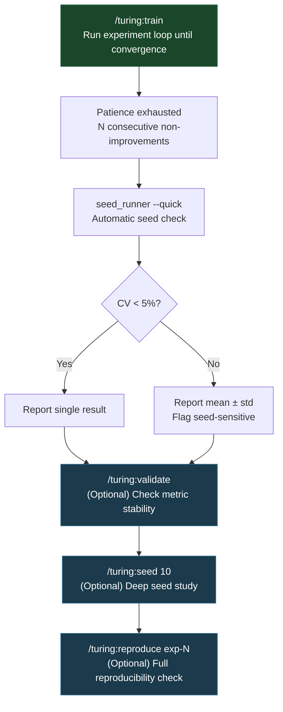

# Convergence Detection

The experiment loop must know when to stop. Running forever wastes compute. Stopping too early leaves performance on the table. Turing uses a patience-based convergence detector backed by statistical validation to make this decision.

## Configuration

Convergence behavior is controlled by two settings in the project's `config.yaml`:

```yaml
convergence:
  patience: 3                    # Consecutive non-improvements before stopping
  improvement_threshold: 0.005   # 0.5% relative improvement required
```

Defaults (from `config/defaults.yaml`) are conservative: patience of 3 with a 0.5% improvement threshold. These can be tuned per-project.

## When to Stop

The convergence rule is simple: **N consecutive non-improvements trigger a stop.**

An "improvement" is defined as a relative gain in the primary metric that exceeds `improvement_threshold`. A 0.4% gain when the threshold is 0.5% counts as a non-improvement; the change is within noise.

```
Experiment  Metric   Delta    Improvement?   Streak
exp-001     0.820    --       --             0
exp-002     0.835    +1.8%    Yes            0
exp-003     0.831    -0.5%    No             1
exp-004     0.837    +0.2%    No (< 0.5%)    2
exp-005     0.834    -0.4%    No             3  <- STOP (patience=3)
```

!!! info "Relative, not absolute"
    The threshold is relative: `(new - old) / old >= threshold`. This means the bar scales with the current performance level. A 0.5% relative improvement at 0.50 accuracy is +0.0025. At 0.95 accuracy, it is +0.00475. The threshold gets harder to clear as the model improves, which is correct; gains shrink near the optimum.

## Override: max_iterations

If the user provides a max iteration count via `/turing:train N`, that takes precedence:

```
/turing:train 10       # Stop after 10 iterations, regardless of convergence
/turing:train ml/churn 5  # Target project + iteration limit
```

Without an explicit limit, the loop runs until convergence.

## The Convergence Script

`scripts/check_convergence.py` implements the detection logic. It reads the experiment log and applies the patience/threshold rules:

```bash
python scripts/check_convergence.py
```

This script is called by the stop hook (`scripts/stop-hook.sh`) which runs automatically after each experiment when using `/loop` integration. If convergence is detected, the hook exits with code 2, which signals `/loop` to halt.

## Noisy Metrics and /turing:validate

Some ML tasks produce metrics with high variance across runs. A model that scores 0.83 on one run and 0.79 on the next makes convergence detection unreliable: the patience counter triggers on noise, not genuine plateau.

`/turing:validate` detects and fixes this:

```bash
python scripts/validate_stability.py --auto
```

**What it does:**

1. Runs the current pipeline N times (default 5)
2. Computes coefficient of variation (CV) across runs
3. Reports stability verdict:

| CV | Verdict | Action |
|----|---------|--------|
| < 5% | **Stable** | Single-run evaluation is sufficient |
| >= 5% | **Unstable** | Multi-run with median recommended |

With `--auto`, it automatically writes `evaluation.n_runs: 3` to `config.yaml` when variance is too high. Subsequent experiments use the median of 3 runs instead of a single run, smoothing out noise.

!!! warning "Validate before long sweeps"
    Running a 36-experiment hyperparameter sweep with unstable single-run evaluation means the convergence detector sees noise, not signal. Run `/turing:validate --auto` first to ensure the evaluation is stable enough for the convergence threshold to be meaningful.

## Seed Studies: /turing:seed

A deeper level of validation. Seed studies test whether the current best result is robust across random seeds or whether it got lucky with the default seed.

```bash
/turing:seed              # 5 seeds on best experiment
/turing:seed --quick      # 3 seeds for fast check
/turing:seed 10           # 10 seeds for thorough study
```

**Output:**

```
Seed Study: exp-042 (5 seeds)
┌──────┬──────────┐
│ Seed │ Accuracy │
├──────┼──────────┤
│   42 │   0.8523 │
│  123 │   0.8467 │
│  456 │   0.8501 │
│  789 │   0.8489 │
│ 1024 │   0.8512 │
├──────┼──────────┤
│ Mean │   0.8498 │
│  Std │   0.0021 │
│   CV │    0.25% │
│  95% │ ±0.0026  │
└──────┴──────────┘
Verdict: STABLE (CV < 5%)
```

The experiment loop automatically runs `seed_runner.py --quick` before declaring final results at convergence. Seed-sensitive results (CV >= 5%) are reported as mean +/- std, not single-seed numbers.

Results are saved to `experiments/seed_studies/exp-NNN-seeds.yaml` for the audit trail.

## Reproducibility Verification: /turing:reproduce

The strongest validation: re-run a logged experiment from its saved configuration and verify the metrics match.

```bash
/turing:reproduce exp-042                   # 3 runs, 2% tolerance
/turing:reproduce exp-042 --strict          # Exact match (1e-6)
/turing:reproduce exp-042 --tolerance 0.05  # 5% tolerance, lenient
```

**Verdicts:**

| Verdict | Meaning |
|---------|---------|
| `reproducible` | Metrics match exactly (deterministic algorithm) |
| `approximately_reproducible` | Within tolerance or original falls in 95% CI |
| `not_reproducible` | Outside tolerance and CI |
| `environment_changed` | Metrics diverge AND library versions differ |

The reproduce script recovers the exact configuration from the experiment log and model artifact (`model.joblib` contains the full config dict at training time). If library versions have changed, it flags the environment diff.

Reports are saved to `experiments/reproductions/exp-NNN-repro.yaml`.

## The Convergence Pipeline

Putting it all together, the full statistical rigor pipeline looks like this:



The automatic checks happen without user intervention. The optional commands provide deeper validation for results that matter.
