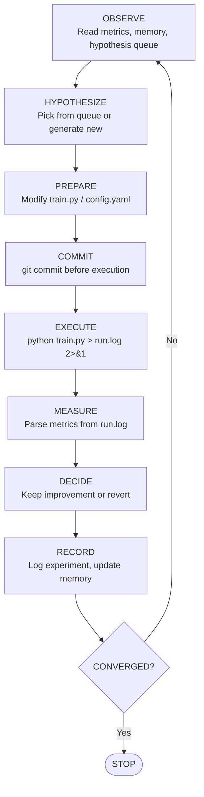
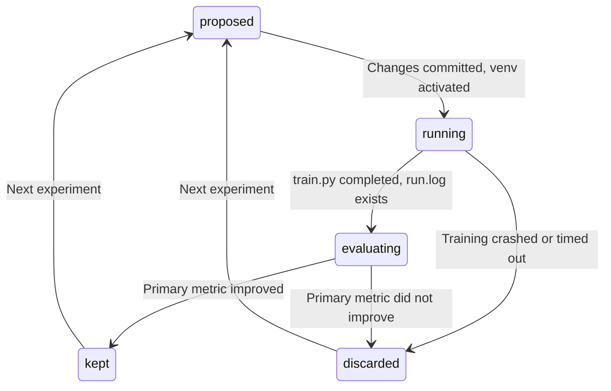

# The Experiment Loop

The experiment loop is the core protocol of Turing. It encodes the scientific method as a repeatable, auditable process: observe the current state, form a hypothesis, test it, measure the result, decide whether to keep it, and record everything.

The loop runs inside the `@ml-researcher` agent, dispatched by `/turing:train`.

## The Protocol



## Step-by-Step

### 1. OBSERVE

Read the current state of the world. The agent gathers context before forming any hypothesis.

```bash
python scripts/show_metrics.py --last 5
python scripts/manage_hypotheses.py next 2>/dev/null || echo "No queued hypotheses"
cat RESEARCH_PLAN.md 2>/dev/null || true
```

The agent also reads actual git diffs from recent discarded experiments, not its own memory of what it changed, but the literal code differences:

```bash
for branch in $(git branch --list 'exp/*' | tail -3); do
  echo "=== $branch ==="
  git diff main...$branch -- train.py config.yaml 2>/dev/null | head -40
done
```

!!! note "Why diffs, not descriptions"
    The agent's summary of what it tried can drift from reality. Git diffs are the ground truth. This is one of the six anti-cheating layers; see [Anti-Cheating Guardrails](anti-cheating.md).

### 2. HYPOTHESIZE

Check the hypothesis queue first. Human-injected hypotheses (via `/turing:try`) have high priority and are tested before the agent generates its own.

If generating a new hypothesis, the agent registers it in the queue with structured metadata before executing:

```bash
python scripts/manage_hypotheses.py add "switch to LightGBM with dart boosting" \
  --priority medium --source agent \
  --model-type lightgbm \
  --hyperparams '{"boosting_type": "dart", "n_estimators": 200}' \
  --family model-comparison \
  --tags "lightgbm,dart" \
  --parent exp-003 \
  --expected "dart boosting should reduce overfitting"
```

Every experiment must have a corresponding hypothesis. The hypothesis database is a complete record of every idea, human and agent alike.

### 3. PREPARE

Modify the hypothesis space:

- **`config.yaml`** for hyperparameter changes (preferred; no code changes needed)
- **`train.py`** for structural changes (model architecture, training logic)

Nothing else is modifiable. `prepare.py` is read-only. `evaluate.py` is invisible.

### 4. COMMIT

Commit all changes to git before running. This is non-negotiable.

```bash
git checkout -b exp/007-lightgbm-dart
git commit -am "exp: switch to LightGBM with dart boosting"
```

The commit happens before execution so that every experiment variant is preserved in version control, regardless of whether it improves or not. Failed experiments are as valuable as successful ones; they define the boundary of what does not work.

### 5. EXECUTE

Run training with output redirected:

```bash
source .venv/bin/activate && python train.py > run.log 2>&1
```

!!! warning "Output redirection is mandatory"
    The agent must never read raw training output in the terminal. Redirecting to `run.log` and parsing with `grep` prevents the agent from being overwhelmed by verbose output and ensures structured metric extraction.

### 6. MEASURE

Parse metrics from the run log. The evaluation harness writes metrics between `---` delimiters:

```bash
grep -A 10 "^---" run.log | head -10
```

The agent sees the metrics but not how they were computed. `evaluate.py` is a black box: the agent knows the score but not the scoring function.

### 7. DECIDE

Compare the primary metric against the current best:

**If improved:**
- Keep the commit on the experiment branch
- Merge to main: `git checkout main && git merge exp/007-lightgbm-dart`
- Copy model artifact: `cp models/model.joblib models/best/model.joblib`
- Update `models/best/metadata.json`

**If NOT improved:**
- Return to main without merging: `git checkout main`
- The experiment branch is preserved for later analysis

### 8. RECORD

Log everything, kept and discarded experiments alike:

```bash
python scripts/log_experiment.py experiments/log.jsonl exp-007 kept \
  '{"accuracy": 0.87, "f1_weighted": 0.86}' \
  '{"model_type": "lightgbm", "hyperparams": {"boosting_type": "dart"}}' \
  models/model.joblib "Switch to LightGBM with dart boosting — 2% improvement"
```

Update hypothesis status with results:

```bash
python scripts/manage_hypotheses.py mark hyp-007 tested \
  --result exp-007 \
  --metrics '{"accuracy": 0.87}' \
  --notes "LightGBM dart boosting improved accuracy by 2%"
```

Then synthesize a decision packet and auto-queue follow-up hypotheses:

```bash
python scripts/synthesize_decision.py --experiment exp-007 --auto-queue
```

The decision synthesizer produces a verdict (`promote`, `branch_followup`, `abandon`, or `fix_and_retry`) and automatically queues follow-up hypotheses for promising directions.

Finally, the agent updates its persistent memory at `.claude/agent-memory/ml-researcher/MEMORY.md` with the best result, what was tried, and promising next directions.

### 9. CONVERGE?

Check stopping conditions:

1. **N consecutive non-improvements** (from `config.yaml` -> `convergence.patience`): STOP
2. **`max_iterations` reached** (if provided by user): STOP
3. Otherwise: return to OBSERVE

Before declaring final results, the agent runs a quick seed study to verify robustness:

```bash
python scripts/seed_runner.py --quick
```

If the coefficient of variation exceeds 5%, the result is seed-sensitive and gets reported as mean +/- std rather than a single-seed number.

## The State Machine

Each experiment transitions through formally defined states from `config/lifecycle.toml`:



| Transition | Precondition |
|-----------|-------------|
| proposed -> running | Changes committed to git, venv activated |
| running -> evaluating | train.py completed without error, run.log exists |
| evaluating -> kept | Primary metric improved over prior best |
| evaluating -> discarded | Primary metric did not improve |
| running -> discarded | Training crashed or timed out |

## Strategy Escalation

When consecutive experiments fail to improve, the agent escalates its approach:

| Consecutive Failures | Strategy | Description |
|---------------------|----------|-------------|
| 0-1 | **EXPLOIT** | Push further in the current direction |
| 2-3 | **RE-READ** | Stop. Re-read all code from scratch. |
| 4-5 | **COMBINE** | Combine two previously successful ideas |
| 6+ | **RADICAL** | Abandon the current approach entirely |

The agent tracks its failure count and announces escalation transitions.
