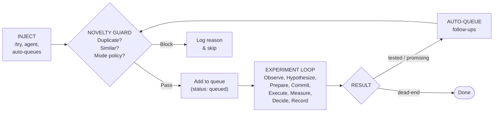

# The Hypothesis Database

Every experiment starts as a hypothesis. Turing maintains a structured database of hypotheses, both human-injected (via `/turing:try`) and agent-generated (during the experiment loop). The database serves as the complete record of what was considered, what was tried, and what worked.

## Structure

The hypothesis database uses a two-file architecture:

```
project/
├── hypotheses.yaml          # Index -- summary of all hypotheses
└── hypotheses/
    ├── hyp-001.yaml         # Detail file for hypothesis 001
    ├── hyp-002.yaml         # Detail file for hypothesis 002
    └── hyp-003.yaml         # ...
```

**`hypotheses.yaml`** is the index. It contains the ID, description, status, priority, and source of each hypothesis. The experiment loop reads this during the OBSERVE step to find the next hypothesis to test.

**`hypotheses/hyp-NNN.yaml`** is the detail file. It contains the full structured specification of what to change and what to expect.

## Detail File Fields

```yaml
id: hyp-007
description: "Switch to LightGBM with dart boosting for reduced overfitting"
source: human                    # human | agent
status: queued                   # queued | in-progress | tested | promising | dead-end
priority: high                   # high | medium | low
created_at: '2026-04-01T14:30:00+00:00'

architecture:
  model_type: lightgbm
  boosting_type: dart

hyperparameters:
  n_estimators: 200
  learning_rate: 0.05
  max_depth: 6

features:
  add: []
  remove: []
  transform: []

expected_outcome:
  metric: accuracy
  direction: higher
  reasoning: "Dart boosting applies dropout to trees, which should reduce overfitting observed in exp-003"

result:
  experiment_id: exp-007         # Filled after testing
  metrics:
    accuracy: 0.87
    f1_weighted: 0.86
  verdict: promising
  notes: "2% accuracy improvement, overfitting gap reduced from 0.08 to 0.03"

parent_experiment: exp-003       # Which experiment inspired this
parent_hypothesis: null          # Which hypothesis spawned this (follow-ups)
family: model-comparison         # Experiment family tag
tags: [lightgbm, dart, overfitting]
```

## The Lifecycle



### Injection

Hypotheses enter the system two ways:

**Human-injected** via `/turing:try`:
```bash
/turing:try switch to LightGBM with dart boosting
/turing:try archetype:model_comparison
```

Human hypotheses get `priority: high` and `source: human`. The agent tests them before generating its own.

**Agent-generated** during the experiment loop:
```bash
python scripts/manage_hypotheses.py add "increase max_depth to 8" \
  --priority medium --source agent \
  --model-type xgboost \
  --hyperparams '{"max_depth": 8}' \
  --family hyperparameter-sweep \
  --parent exp-005
```

**Auto-queued** by the decision synthesizer after an experiment:
```bash
python scripts/synthesize_decision.py --experiment exp-007 --auto-queue
```

The synthesizer produces a verdict (`promote`, `branch_followup`, `abandon`, `fix_and_retry`) and automatically queues follow-up hypotheses for `branch_followup` and `fix_and_retry` outcomes.

## The Novelty Guard

Before a hypothesis is added to the queue, it passes through the novelty guard (`scripts/novelty_guard.py`). The guard prevents the agent from re-running experiments it has already tried.

### How It Works

1. **Normalize** the hypothesis description using alias tables from `config/novelty_aliases.yaml`:
   - Phrase aliases: "learning rate" -> "lr", "random forest" -> "rf"
   - Token aliases: "increase" -> "up", "decrease" -> "down", "switch" -> "change"
   - Stopword removal: strip "a", "the", "to", "try", etc.
   - Concept extraction: group tokens into semantic concepts (lr, architecture, regularization, features, etc.)

2. **Compare** against all previous hypotheses using the normalized form. Two hypotheses that say "increase the learning rate" and "raise step size" normalize to the same representation.

3. **Apply mode policy.** The current research mode (explore/exploit/replicate) determines what kinds of hypotheses are allowed:

| Hypothesis Type | Explore | Exploit | Replicate |
|----------------|---------|---------|-----------|
| Novel idea | Allow | Caution | Block |
| Known success variant | Block | Allow | Allow |
| Incremental follow-up | Block | Allow | Allow |
| Repeat of failure | Block | Block | Caution |
| Exact duplicate | Block | Block | Allow |

!!! note "Replicate mode allows duplicates"
    In replicate mode, re-running the same experiment is the point. The novelty guard relaxes to allow exact reruns for reproducibility verification.

### Concept Patterns

The novelty guard understands semantic groupings:

```yaml
concept_patterns:
  lr: ["lr", "learning_rate", "step_size"]
  architecture: ["depth", "width", "layers", "heads", "nn", "rf", "gbdt"]
  regularization: ["dropout", "weight_decay", "l1", "l2", "early_stop"]
  features: ["feat_eng", "feat_sel", "onehot", "label_enc", "feature"]
  data: ["split", "augment", "sample", "oversample", "undersample", "cv"]
  optimizer: ["adam", "sgd", "optim", "momentum", "scheduler"]
  ensemble: ["voting", "stacking", "blending", "bagging", "boosting"]
```

Two hypotheses that touch the same concept group with the same directional tokens are flagged as likely duplicates, even if the surface descriptions differ.

## Experiment Families

Hypotheses are grouped into families, strategic clusters of related experiments. Families enable:

- **Progress tracking:** how many experiments in this family have been tested?
- **Exhaustion detection:** has this line of inquiry been fully explored?
- **Performance summaries:** what is the best result from each family?

```bash
python scripts/show_families.py
```

Example output:

```
Family               Tested  Best Acc  Status
model-comparison     5/5     0.852     EXHAUSTED
hyperparameter-sweep 12/36   0.871     IN PROGRESS
feature-engineering  3/8     0.865     IN PROGRESS
regularization       0/4     --        NOT STARTED
```

When a family is exhausted (all hypotheses tested), the agent is guided to move to a different family rather than continuing to mine a depleted vein.

## The 8 Archetypes

Archetypes are pre-defined experiment strategies defined in `config/experiment_archetypes.yaml`. They provide structured starting points instead of ad-hoc free text.

| Archetype | Purpose | Expected Experiments |
|-----------|---------|---------------------|
| `model_comparison` | Compare model families (XGBoost, LightGBM, RF, LR, MLP) with statistical tests | ~5 |
| `hyperparameter_sweep` | Grid search the current best model's parameter space | 15-36 |
| `feature_sweep` | Add/remove feature transforms one at a time | 6-10 |
| `regularization_search` | Binary search for optimal regularization strength | 4-6 |
| `ensemble_construction` | Voting, stacking, blending of top models | 4-6 |
| `learning_rate_schedule` | Learning rate vs number of estimators tradeoff | 4-5 |
| `data_quality_audit` | Class balance, label noise, leakage investigation | 3-5 |
| `ablation_study` | Remove features one at a time to measure contribution | N+1 |

### Using Archetypes

Archetypes can be injected via `/turing:try`:

```bash
/turing:try archetype:model_comparison
/turing:try archetype:feature_sweep
```

This expands the archetype into a sequence of hypotheses with the correct family tag, expected experiment count, and step-by-step instructions. The agent follows the archetype's protocol but fills in project-specific details (metric names, model types, data characteristics) from `config.yaml`.

### When to Use Each Archetype

<div class="tier-stack">
  <div class="tier-card tier-card--danger">
    <h4>Early — Establish direction</h4>
    <p><code>model_comparison</code> · <code>data_quality_audit</code><br/>Which model family works best? Is the data clean?</p>
  </div>
  <div class="tier-card tier-card--muted">
    <h4>Mid — Optimize the winner</h4>
    <p><code>feature_sweep</code> · <code>hyperparameter_sweep</code> · <code>regularization_search</code> · <code>learning_rate_schedule</code><br/>Tune parameters, add/remove features, find the sweet spot.</p>
  </div>
  <div class="tier-card tier-card--dark">
    <h4>Late — Combine and finalize</h4>
    <p><code>ensemble_construction</code> · <code>ablation_study</code><br/>Combine models, remove noise features, ship.</p>
  </div>
</div>

## Querying the Database

```bash
# List all queued hypotheses
python scripts/manage_hypotheses.py list --status queued

# Show full detail for a hypothesis
python scripts/manage_hypotheses.py show hyp-007

# Get the next hypothesis to test (highest priority first)
python scripts/manage_hypotheses.py next

# Mark a hypothesis as in-progress
python scripts/manage_hypotheses.py mark hyp-007 in-progress

# Record results
python scripts/manage_hypotheses.py mark hyp-007 tested \
  --result exp-007 \
  --metrics '{"accuracy": 0.87}' \
  --notes "2% improvement with dart boosting"
```
