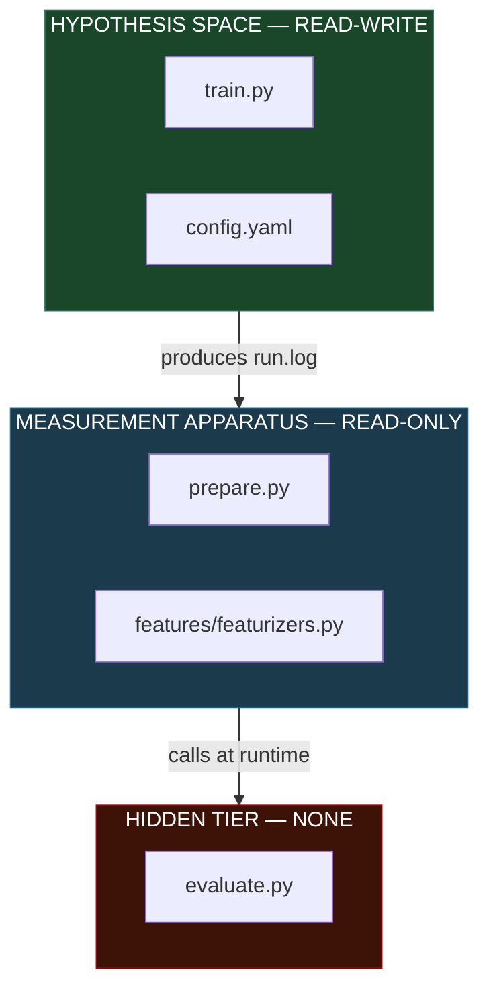
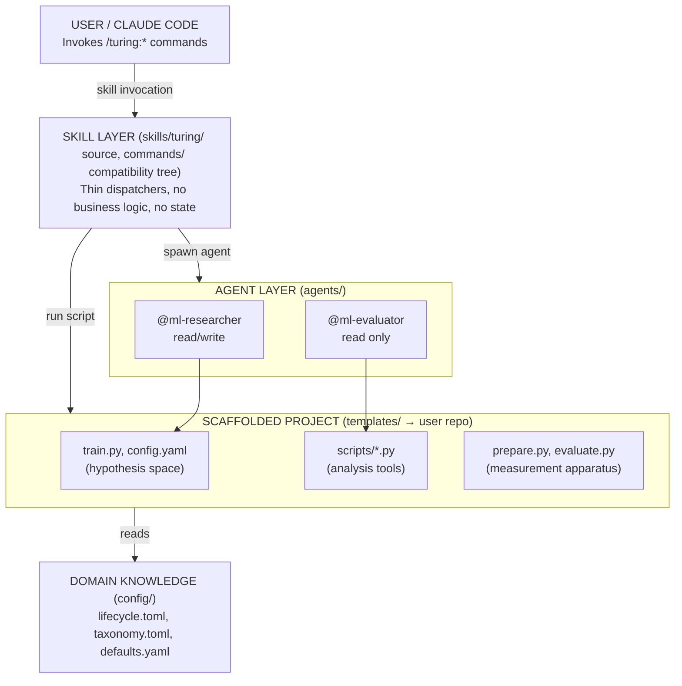

# Architecture

Turing is a Claude Code plugin that scaffolds ML experiment infrastructure into user projects, then provides AI agents that autonomously iterate through a formal experiment loop. The system enforces a strict separation between the **hypothesis space** (what the agent can change) and the **measurement apparatus** (how results are evaluated).

## At a Glance

| Dimension | Count |
|-----------|-------|
| Commands | 74 |
| Agents | 2 |
| Config files | 11 |
| Template scripts | 93 |
| ADRs | 16 |
| Tests | 2032 |

## Directory Structure

```
turing/
├── skills/                    # Editable skill source -- router + registered subcommands
│   └── turing/
│       ├── SKILL.md           # Router and execution contract
│       ├── train/SKILL.md     # The experiment loop
│       ├── try/SKILL.md       # Inject hypotheses
│       ├── sweep/SKILL.md     # Hyperparameter sweeps
│       ├── validate/SKILL.md  # Metric stability
│       ├── seed/SKILL.md      # Multi-seed studies
│       ├── reproduce/SKILL.md # Reproducibility verification
│       ├── status/SKILL.md    # Experiment dashboard
│       ├── compare/SKILL.md   # Side-by-side comparison
│       ├── brief/SKILL.md     # Research intelligence report
│       ├── rules/
│       │   └── loop-protocol.md # Safety constraints
│       └── ...                # 64 more commands
│
├── commands/                  # Generated legacy compatibility tree
│   ├── turing.md              # Compatibility copy of skills/turing/SKILL.md
│   ├── <command>.md           # Compatibility copies of registered skills
│   └── rules/                 # Compatibility copy of command rules
│
├── agents/                    # Agent layer -- 2 agents
│   ├── ml-researcher.md       # Read/Write/Edit/Bash -- 200 turns
│   └── ml-evaluator.md        # Read/Bash only -- 50 turns
│
├── config/                    # Domain knowledge + command registry -- 11 files
│   ├── defaults.yaml          # Fallback hyperparameters
│   ├── lifecycle.toml         # Experiment state machine
│   ├── taxonomy.toml          # Experiment type classification
│   ├── experiment_archetypes.yaml  # 8 structured strategies
│   ├── novelty_aliases.yaml   # Duplicate detection normalization
│   ├── task_taxonomy.yaml     # ML task classification
│   ├── failure_modes.yaml     # Failure categorization
│   ├── relationships.toml     # ADR dependency graph
│   ├── state.toml             # Session state
│   └── watch_alerts.yaml      # Watch alert configuration
│
├── templates/                 # Scaffolded into user projects
│   ├── train.py               # Agent-editable training pipeline
│   ├── prepare.py             # READ-ONLY data preparation
│   ├── evaluate.py            # HIDDEN evaluation + probes
│   ├── config.yaml            # Hyperparameters
│   ├── program.md             # The experiment loop protocol
│   ├── features/              # Feature engineering pipeline
│   ├── scripts/               # 22 Python scripts + 2 hooks
│   └── tests/                 # Test fixtures
│
├── tests/                     # Plugin test suite (2010 tests)
├── src/                       # npm installer (5 JS files)
├── bin/                       # CLI entrypoints
├── docs/                      # Documentation + 16 ADRs
└── hypotheses/                # Hypothesis detail files
```

## The Three-Tier Access Model

The core architectural invariant is a strict separation of file access into three tiers. This is not a convention; it is enforced at the tool level.



!!! warning "Why evaluate.py is hidden"
    If the agent could read the scoring function, it could exploit fixed seeds, memorize test data distributions, or reverse-engineer the metric calculation. The separation is not a prompt instruction; it is an architectural constraint enforced by tool-level access control.

## Layer Boundaries



## Configuration Philosophy

Domain knowledge is encoded in config files, not agent prompts:

- **TOML** for system-wide domain knowledge (lifecycle state machine, taxonomy, relationships)
- **YAML** for project-specific parameters (hyperparameters, data paths, experiment archetypes)

This means the agent's behavior changes by editing config files, not by rewriting prompts. The experiment lifecycle, convergence rules, and experiment classification all live in parseable, testable data structures.

## Further Reading

- [The Experiment Loop](experiment-loop.md): the 9-step protocol
- [Anti-Cheating Guardrails](anti-cheating.md): six defense layers
- [Agent Architecture](agents.md): capability boundaries
- [Convergence Detection](convergence.md): when to stop
- [The Hypothesis Database](hypothesis-database.md): structured experiment queue
