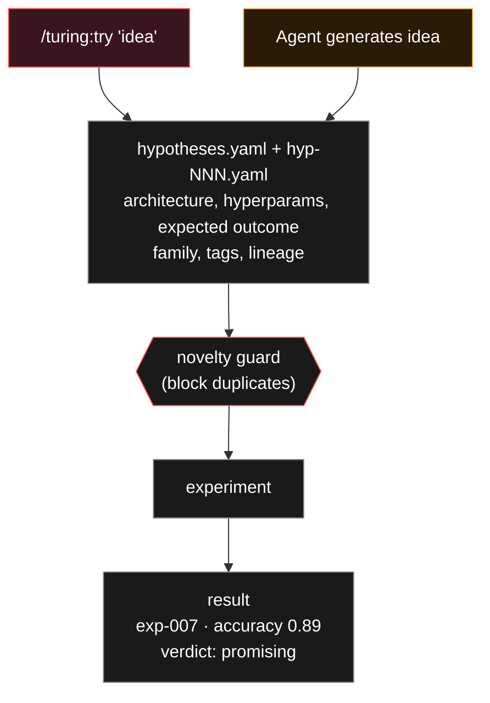

# On Experiment Tracking as Institutional Memory

!!! quote "George Santayana"

    "Those who cannot remember the past are condemned to repeat it."

---

## The Markov Problem

An LLM agent without persistent memory is a [Markov chain](https://en.wikipedia.org/wiki/Markov_chain). Its next action depends only on its current state, not on the path that led there. This is catastrophically inefficient for optimization: the agent will re-try failed approaches, abandon promising directions, and fail to recognize when it has converged. It will keep flipping coins it has already flipped.

The tragedy is not just inefficiency. It is structural unsoundness. When experiment results are tracked in notebook cells rather than structured logs, reproducibility is aspirational. When a promising direction is abandoned because the researcher forgot what they tried three hours ago, the search is not even a search. It is a random walk with amnesia.

---

## The Structured Memory Stack

Turing addresses this with a layered memory system where each layer serves a distinct purpose:

| System | Format | Purpose |
|--------|--------|---------|
| **Hypothesis database** | `hypotheses.yaml` + `hypotheses/hyp-NNN.yaml` | Complete ledger of every idea, human and agent, with full detail |
| **Experiment log** | `experiments/log.jsonl` | Append-only record of every experiment run |
| **Novelty guard** | `scripts/novelty_guard.py` | Blocks duplicate and near-duplicate hypotheses before execution |
| **Agent memory** | `.claude/agent-memory/ml-researcher/MEMORY.md` | Working notes across sessions |
| **Git history** | Experiment branches | Every code variant preserved |

!!! info "Why Five Layers?"

    Each layer captures a different temporal resolution. The hypothesis database is the strategic record: what was proposed, why, and what happened. The experiment log is the operational record: raw metrics, timestamps, configs. The novelty guard is the tactical filter, preventing waste. Agent memory is the working scratchpad. Git is the forensic archive: every line of code, every change, recoverable.

---

## The Hypothesis Lifecycle

Every experiment, whether human-injected or agent-generated, flows through the hypothesis database:

The index (`hypotheses.yaml`) is the lightweight queue. The detail files (`hypotheses/hyp-NNN.yaml`) hold the full structured record: architecture, hyperparameters, features, expected outcome, actual result, lineage, family tags. Both are updated atomically.

---

## The Novelty Guard

The novelty guard deserves special attention. It reads the full hypothesis history and blocks duplicate or near-duplicate ideas before they consume compute. This matters most across `/loop` sessions where the agent's context window is lost. Without the guard, the agent would cheerfully re-run its best idea from three sessions ago, convinced it had just invented it.

The guard uses semantic similarity, not exact matching. "Try LightGBM with dart boosting" and "Switch to LightGBM dart mode" are the same hypothesis. The guard catches both.

---

## Why This Matters

!!! quote "Max Planck"

    "An experiment is a question which science poses to Nature, and a measurement is the recording of Nature's answer."

If you cannot remember the questions you have already asked, you cannot conduct a search. You can only wander. Turing's memory stack turns the experiment loop from wandering into navigation, with each experiment informed by every experiment that came before it, across sessions, across context windows, across days.
