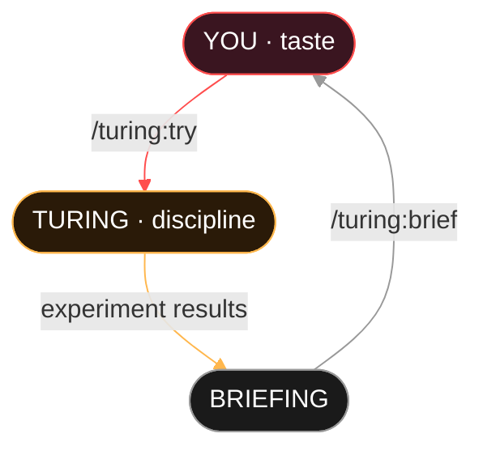

# The Taste-Leverage Loop

Turing is not a black box you point at data and hope for the best. It is a conversation between your taste and the agent's discipline.

---

## The Loop



The loop is bidirectional. You inject hypotheses. The agent executes them. The briefing tells you what happened. You inject new hypotheses informed by the results. The agent never forgets what it tried. You never lose context between sessions.

---

## Two Verbs

The entire human-facing interface is built around two verbs:

- **`/turing:try`**: how taste reaches the agent
- **`/turing:brief`**: how results reach the human

Everything else is infrastructure connecting those two endpoints. The `try` command accepts free text; six words are enough to redirect an entire research campaign. The `brief` command returns a structured summary of what happened, what was exhausted, and what looks promising.

!!! info "Why two verbs?"

    Research taste is not a parameter you tune. It is a judgment call that requires seeing results, reflecting, and redirecting. The try/brief loop is designed to make that cycle as frictionless as possible: inject an idea, let it run, read the outcome, inject the next idea.

---

## What This Looks Like in Practice

**Morning 1:** You have a dataset and a prediction task.

```
/turing:init
# Answer: project name, metric, data location
# Turing scaffolds everything
```

**Morning 1, 10 minutes later:**

```
/turing:train
# Agent runs 5-10 experiments autonomously
# XGBoost baseline → hyperparameter sweep → convergence
```

**Morning 1, 30 minutes later:**

```
/turing:brief
# Campaign: 8 experiments, 5 kept, accuracy 0.82 → 0.87
# Best: XGBoost, max_depth=6, n_estimators=200
# Exhausted: hyperparameter tuning on XGBoost
# Recommendation: try LightGBM or feature engineering
```

**Your taste kicks in:**

```
/turing:try switch to LightGBM with dart boosting — XGBoost plateaued
/turing:try add polynomial interaction features for the numeric columns
/turing:train
```

**Afternoon:**

```
/turing:brief --deep
# Standard briefing + literature-grounded suggestions
# Papers suggest: target encoding for high-cardinality categoricals
# → Auto-queued as hyp-012
```

**You leave. Come back tomorrow.**

```
/turing:brief
# Everything is there. Nothing was forgotten.
# The hypothesis database has the complete trail.
```

That's the interface. Six words to inject an idea. One command to get a briefing. The agent handles everything in between.

---

## Hands-Off Operation

For fully autonomous operation, combine Turing with Claude Code's loop:

```
/loop 5m /turing:train
```

The agent trains, evaluates, keeps improvements, discards regressions, detects convergence, and stops. You come back to a briefing.

!!! quote "Amy Tam"

    "Research taste is about how well you choose your coins: how well you choose which problems are worth working on at all."

The taste-leverage loop is designed so that the human contribution, the part that cannot be automated, flows naturally into the system, and the system's output flows naturally back to the human. No dashboards to monitor. No notebooks to manage. Just `try` and `brief`.
